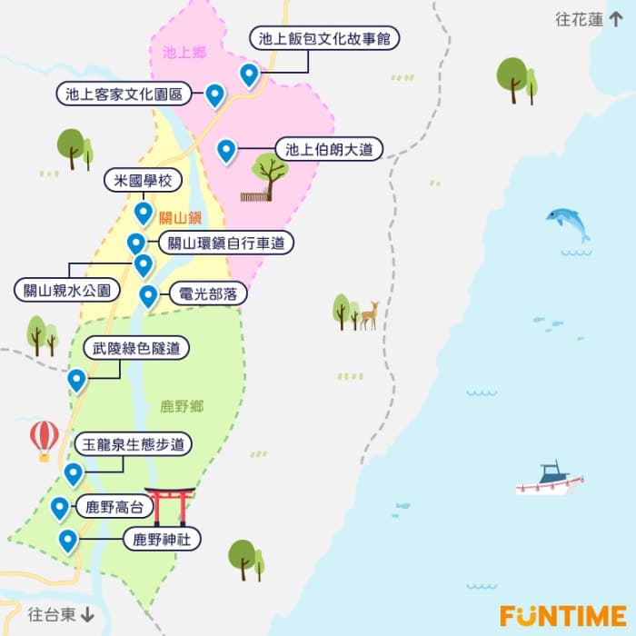

# backlog

.

台東市：伽路蘭海岸、小野柳、鐵花村、台東糖廠文化園區、台東觀光夜市、四維夜市

.

.

Day 1  
小編偷偷說：伯朗大道無法開車進入，得騎乘自行車唷！一進去就有許多租借腳踏車的店非常方便（怕累的人也有電動的不用擔心～）

小編偷偷說：每年5月～6月、10月底～11月初為金黃稻田（詳細稻況可洽池上鄉公所）

交通：台東縣池上鄉伯朗大道

騎著單車，在台東伯朗大道享受微風吹拂與自然之美

前往池上天堂路，在台灣最美公路197縣道欣賞漂鳥作品

武陵綠色隧道 ?

探訪多力米故事館，了解池上米的由來 / 悟饕池上飯包文化故事館

漫步於鹿野高台，欣賞一片片綿延不絕的稻田及茶園，享受空氣中陣陣的茶香

.



Day 2  
  
卑南鄉：富山護漁區  
  
不用早起 , 先到小野柳、加路蘭海岸看台東最美景致，  
  
中午到正氣路美食一條街吃午餐，  
  
下午前往台東森林公園騎腳踏車，在琵琶湖拍個網美照；  
  
接著去寶桑湯圓吃碗豆花，再去採購地瓜酥當伴手禮，~~_然後前往鐵花村聽一場音樂會放鬆身心_~~。

.

.

