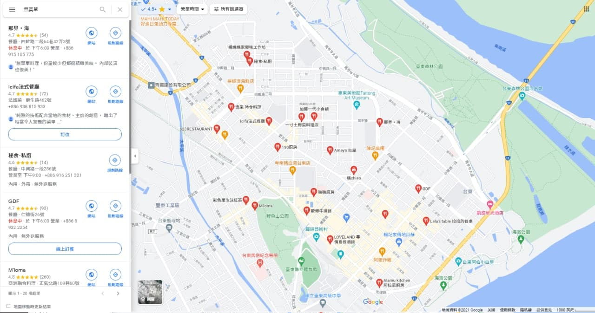

# eat

.

漁采 時令料理



富岡漁港 特選海產店\
中午到 1:50\
晚上到 7:30



都蘭海角咖啡 Dulan Cape Café: 西班牙料理 , 看風景





{% embed url="https://www.facebook.com/capeparadisedulan/posts/3065111117097570?__cft__[0]=AZUbHQNCDcp4hAS1kcoMKgQNMRCExdA4td6mWZt8EamuO9Ulwy2d8s8QATpDxZwWM3jNgkRmzwtBka0Y4DTKDvM4kTBbUycDy3aalN4DYPQqbs_lGHKTWVkzdCWc4IdXjMgawkfeEOVnku7nVqht10xb&__tn__=%2CO%2CP-R" %}

藍蜻蜓 炸雞



池上飯包不但是必吃美食也是必訪景點！\
故事館裡展示了池上飯包的歷史文化，也販賣各種口味飯包、各式古早味及台東特色伴手禮。除了有復古的國小教室造景、傳統古早味室內用餐區，戶外用餐區更是打造成木桌＋舊時火車座椅，甚至還有擺設台鐵列車，讓你真的進去用餐，整個懷舊感大提升！（推薦給你：台東必吃美食懶人包）



.
